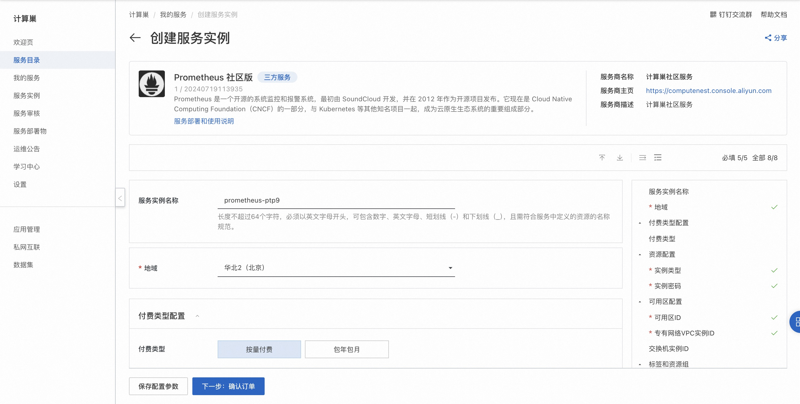
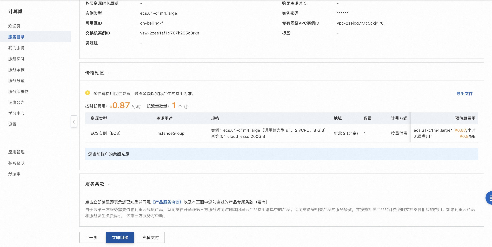
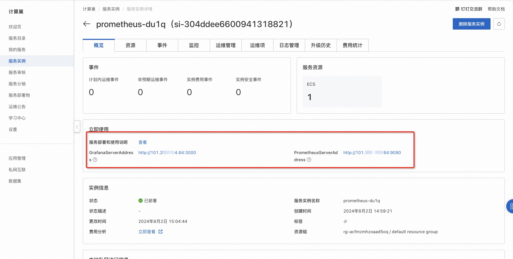
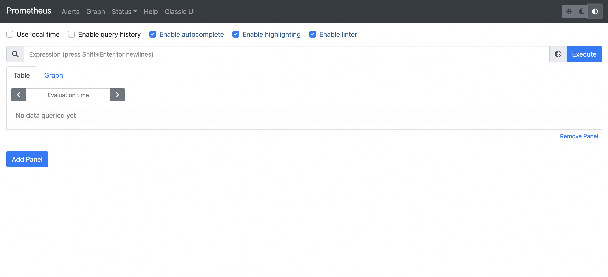

# Prometheus 社区版快速部署

>**免责声明：**本服务由第三方提供，我们尽力确保其安全性、准确性和可靠性，但无法保证其完全免于故障、中断、错误或攻击。因此，本公司在此声明：对于本服务的内容、准确性、完整性、可靠性、适用性以及及时性不作任何陈述、保证或承诺，不对您使用本服务所产生的任何直接或间接的损失或损害承担任何责任；对于您通过本服务访问的第三方网站、应用程序、产品和服务，不对其内容、准确性、完整性、可靠性、适用性以及及时性承担任何责任，您应自行承担使用后果产生的风险和责任；对于因您使用本服务而产生的任何损失、损害，包括但不限于直接损失、间接损失、利润损失、商誉损失、数据损失或其他经济损失，不承担任何责任，即使本公司事先已被告知可能存在此类损失或损害的可能性；我们保留不时修改本声明的权利，因此请您在使用本服务前定期检查本声明。如果您对本声明或本服务存在任何问题或疑问，请联系我们。

## 概述
Prometheus 是一个开源的系统监控和报警系统，最初由 SoundCloud 开发，并在 2012 年作为开源项目发布。它现在是 Cloud Native Computing Foundation（CNCF）的一部分，与 Kubernetes 等其他知名项目一起，成为云原生生态系统的重要组成部分。详情请查看[Prometheus官网](https://prometheus.io/docs/introduction/overview/)。

## 计费说明
Prometheus 社区版上的费用主要涉及：

- 所选vCPU与内存规格
- 系统盘类型及容量
- 公网带宽

## RAM账号所需权限
部署Prometheus 社区版，需要对部分阿里云资源进行访问和创建操作。因此您的账号需要包含如下资源的权限。
  **说明**：当您的账号是RAM账号时，才需要添加此权限。

| 权限策略名称                          | 备注                                 |
|---------------------------------|------------------------------------|
| AliyunECSFullAccess             | 管理云服务器服务（ECS）的权限                   |
| AliyunVPCFullAccess             | 管理专有网络（VPC）的权限                     |
| AliyunROSFullAccess             | 管理资源编排服务（ROS）的权限                   |
| AliyunComputeNestUserFullAccess | 管理计算巢服务（ComputeNest）的用户侧权限         |

## 部署流程

1.访问Prometheus 社区版服务[部署链接](https://computenest.console.aliyun.com/service/instance/create/cn-hangzhou?type=user&ServiceId=service-bc73a0f3b60f44a1b96f)
，按提示填写部署参数：

2.参数填写完成后可以看到对应询价明细，确认参数后点击**下一步：确认订单**。

3.确认订单完成后同意服务协议并点击**立即创建**进入部署阶段。

4.等待部署完成后进入服务实例管理, 在控制台找到Prometheus服务访问链接。

5.单击链接访问服务。

