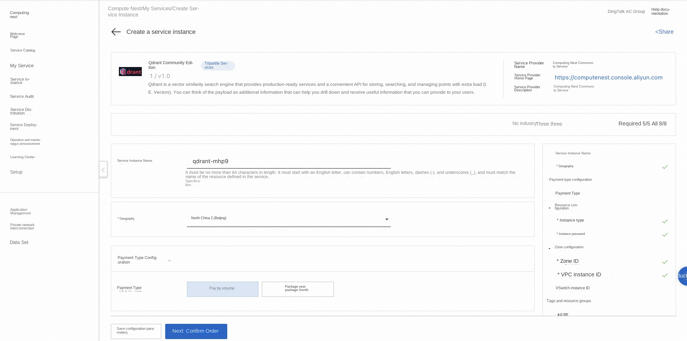
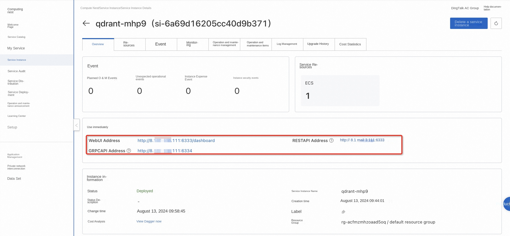
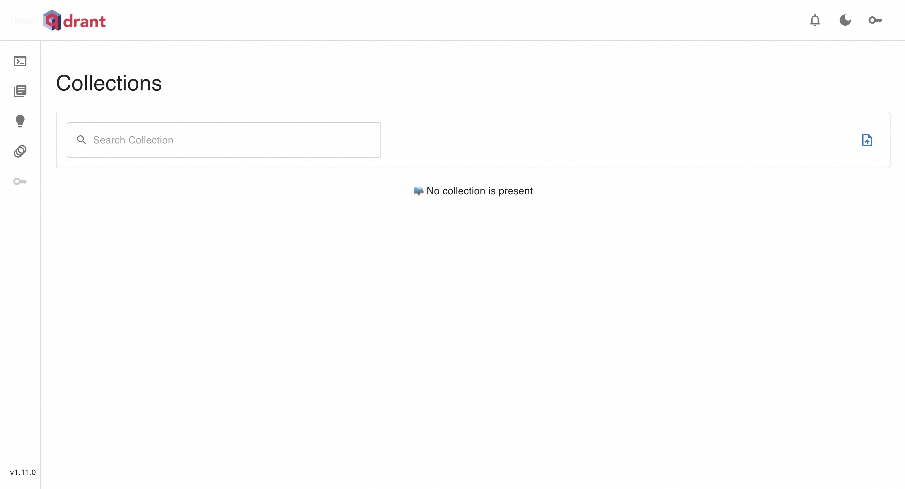

# Qdrant Community Edition Rapid Deployment

## Overview
Qdrant "is a vector similarity search engine that provides production-ready services and a convenient API for storing, searching, and managing points with additional load (I. e., vectors)." You can think of the payload as additional information that can help you drill down and receive useful information that you can provide to your users. Please see [Qdrant website](https://qdrant.tech/documentation/overview/).

## Billing Description
The fees on Qdrant Community Edition mainly relate:

-Selected vCPU and memory specifications
-System disk type and capacity
-public network bandwidth

## Permissions required for RAM accounts
To deploy Qdrant Community Edition, you need to access and create some Alibaba Cloud resources. Therefore, your account must contain permissions for the following resources.
**Note**: This permission is required only when your account is a RAM account.

| Permission policy name | Comment |
| ------------------------------------- | ---------------------------- |
| AliyunECSFullAccess | Permissions to manage ECS instances |
| AliyunVPCFullAccess | Permissions to manage a VPC |
| AliyunROSFullAccess | Manage permissions for Resource Orchestration Service (ROS) |
| AliyunComputeNestUserFullAccess | Manage user-side permissions for the compute nest service (ComputeNest) |

## Deployment process

1. Access Qdrant Community Edition Service [Deployment Link](https://computenest.console.aliyun.com/service/instance/create/cn-hangzhou?type=user&ServiceId=service-eeb5dfd73a414b6e849c)
, fill in the deployment parameters as prompted:

2. After completing the parameters, you can see the corresponding RFQ details. After confirming the parameters, click **Next: Confirm Order**. Confirm the order and agree to the service agreement and click **Create Now** to enter the deployment phase.

4. After the deployment is complete, enter the service instance management and find the Qdrant service access link in the console.

5. Click the link to access the service.

